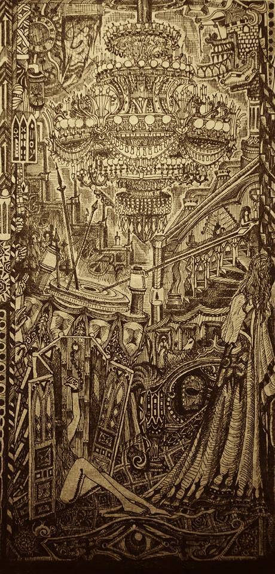

# 籠子
  
___
  
你開心的時候，連地毯都在跳舞。  

更多是沒日沒夜的銬在告解室裡。  

.  

說過會看著，他也說過，你們都說過。  

天真以為只有堡外的人才用眼睛看東西。  

.  

眼睛不會騙人，卻總是騙你自己。  

跟你換顆眼睛好不好？  

我已經藏在大腿的拉鍊裡，安安穩穩的。  

因為知道被你拉開拉鍊前，都沒必要用到眼睛。  

.  

很喜歡床頭板的獨角獸和修士，看不見，是用手摸出來的，  

你卻總是說那是無頭鬼騎士和他的座騎，  

為了除掉一切陰險小人而存在。  

.  

以前最喜歡舉著油燈看你煉金，  

只是這次，連手銬的鑰匙都溶了鑄成匕首，  

把玩著，檢查著。  

.  

如果可以重來一次，要從哪裡開始？  

怎麼做，刃上沾的  

才不會是被你認同過的血?  

