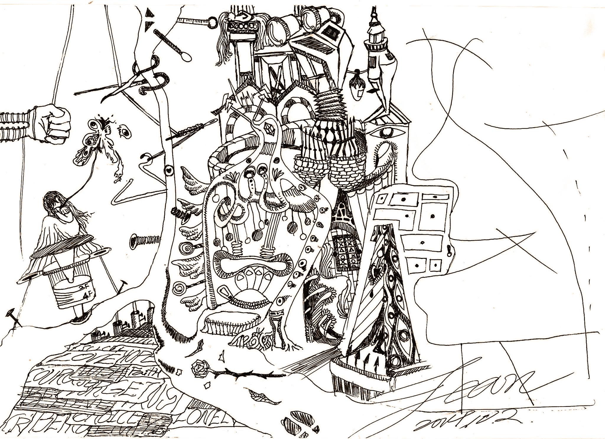

# 蠟燭使者
  
___
  
他為了沒有正眼看過他的她 蓋了一座充滿機關的城堡。

每層階梯都有地毯，每條通道都有暗箭箭孔。船停在岸旁 兩座雕像一次

又一次的確認來者的身分，木船總是用她無法理解的方式載她到城裡。

他知道，她永遠不會穿上他親手逢的長裙馬甲，他只能用最擅長的機關

不厭其煩的展示欣賞，好像她正在著衣一樣。她的目的是書櫃，他便把

所有她喜歡的書擺在她身高所企的地方，她的目的是鑽石，他便把手上

衣服上的全丟到花瓣裡好讓她玩花的時候發現；她的目的是休息，他便

把所有能讓她入睡的管風琴曲都練到滾瓜爛熟。

他養了一隻獨角獸，她來的時候便牽著牠在停泊處久候。

他不會告訴她城堡裡有什麼，卻總是在門環內側刻上她會感興趣的線索，

對，她看不見任何東西。 他們卻總是玩的不亦樂乎!

--------------------

庶民無法忍受她蓋的城堡

滿滿的射擊孔 精巧的機關陷阱 貼金細磨的餐具

狀告國王後的歷史記載著 古堡攻堅成功

女主人消失無蹤 人民取得完全、絕對的勝利

百年後 城堡林立 早已不見她活過的痕跡

有一天 卻被發現吊在充滿屎水沼氣的護城河底

紅褐長捲髮隨水流而微慟

伴隨數不清的攻城器械 和 攻城時壯烈犧牲的精騎兵

他們志趣相投 日夜笙歌

浮腫難辨的臉龐 有著最純淨的自在安詳

和她

--------------------------------------------------------------

堡內的新主人

正苦思如何為廁所塔除臭 為老舊妻妾除名

河底的幽魂 種了些海草 養了些犬馬 生活在鹹水之中

和頂上的活人同地而處 日復一日 年復一年

----------------------------------------------------------------------

聽說 從前的護城河可是沒一滴水的

直到哭了一城河水的她出現

到

再也玩不起13世紀的辦家家酒

因為馬甲 她 真的只適合銬鎖城底

唱著自己的歌 想著自己的美夢會不會成真

不斷為河注入新流 笑迎來每位到訪的貴客

直到某年某月某日 願意為她故事而投河相救的人

出現為止
