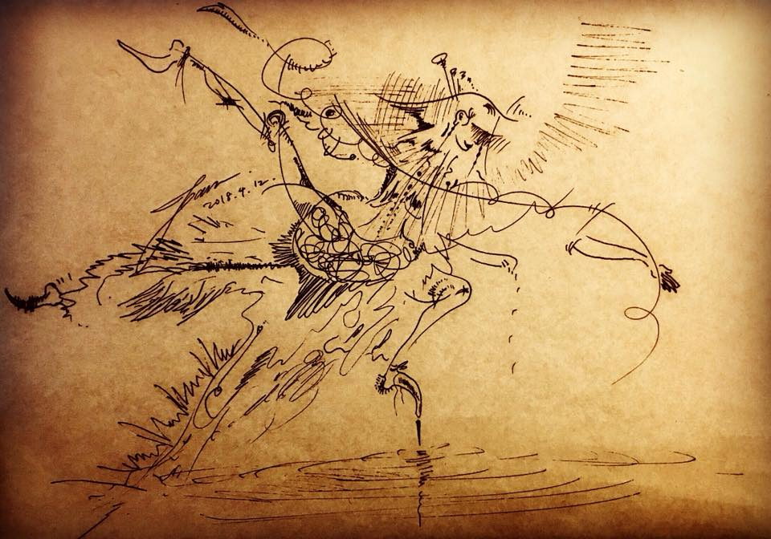

# 跳舞的日子
  
___
  
鑽石簪子 黑金針頭鞋 鵝絨舞衣 費點勁終於都繃上了

雀躍的跳向海際線，穩穩地點在針心

演繹 Tristan und Isolde 的船戲

好開心能辨別墨水筆和ABS的食指

總能在滿月抬頭發呆發笑的第六意識

--------------------------------------

只想把舞跳好，把你責打後的90度做好做滿

用光腳感受離合器的曲線

用脊椎偵測不尋常的轉速

眼神一掃複核一條的誤差

刺激感受十倍誤差的突觸

一起在混亂下分析最精準的光影

細聽鋼材共振後的絕美音色

用眼神溝通完所有的出包和解法
------------------------------------------

感官放大十倍的上千個日子

再緊繃的戲服都得控的了

