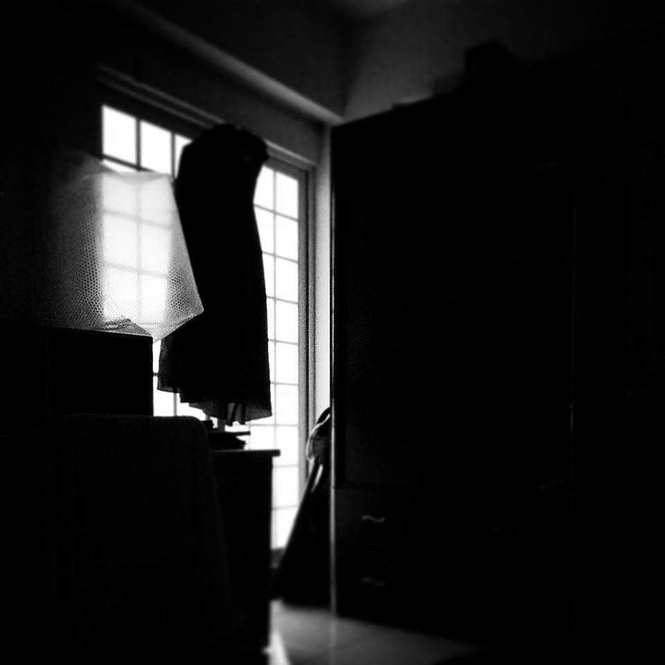

# 鏡
  
___
  
蛇妖夢見鱷魚掉了幾顆牙、她撿了起灌進西洋棋的心

注了一隊蓄勢待發的戰力

國王皇后沾滿箭羽 戰馬肚嵌了知識 韁繩垂飾傷背上

一抬首 二聲令下 三色條紋旗揚起

百頭蛇舌齊震、召紅龍白象一同效命這十秒沙場

十年干戈 煙火四射後殤殘遍地 時間主決定一蛇頭換一只棋

於是妖灌了一副玻璃面具 起名照妖。 鏡

-------

那你何必這樣費心

左手搶下送給誰的玫瑰  

嘴裡咬著他說過的弱點  

再穿的美美的 以為只欠東風  

.  

結果 東風吹走了她的臉  

再也看不到身後的那雙眼睛  

.
