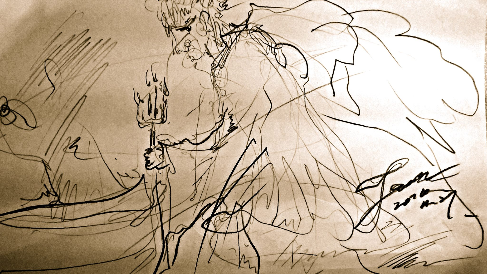

# 船
  
___
  
海弧線的一艘大船船首掛人的棄船

對 充滿當時華麗和諧的鍍金工藝

沒一條準直線 灰塵色系色調豐富有力

老帆斷了 帆布並非古老插圖所繪的殘破陰森

且 輕 輕 飄盪在鹹味氣流中

它們是被海水浸濕透的

沉穩的躺在甲板上 享受平靜

回憶高高在上的風光與風流

船首的人 頭髮日長夜長

她可以肆意的欣賞海面反射的臉龐

但 從來不知自己是長直髮

而非性感的捲金髮
